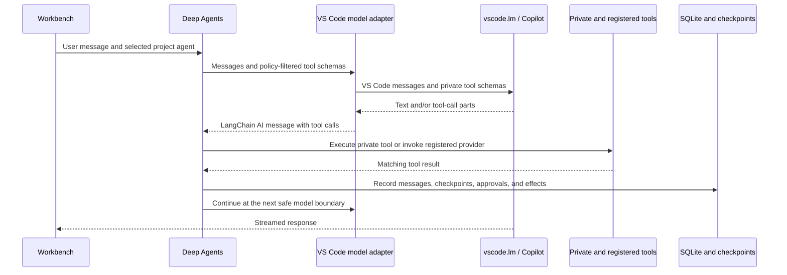

# Bridgit Deep Agents

This VS Code extension is a durable, project-configurable workbench that connects:

- [Deep Agents for JavaScript](https://docs.langchain.com/oss/javascript/deepagents/overview), which owns the agentic loop, planning, tool execution, delegation, and context handling.
- [VS Code's Language Model API](https://code.visualstudio.com/api/extension-guides/ai/language-model), which supplies Copilot-backed models and registered language-model tools.
- A theme-aware workbench with persistent chats, project-agent selection, approval controls, tool activity, recovery, cancellation, and mid-turn steering.

## How the integration works



Bridgit uses two tool paths while retaining one Deep Agents loop:

- Workspace filesystem, command, planning, and delegation tools are private, request-local definitions. Deep Agents validates and executes them.
- Resolved MCP, web, and browser tools are adapted from the live `vscode.lm.tools` registry. Deep Agents selects them, Bridgit enforces the selected agent's policy, and the adapter calls `vscode.lm.invokeTool`.

Registered providers do not grant access by themselves. A tool reaches the model only when the selected project agent allows its canonical Bridgit name, and forced calls are checked again before invocation.

## Run the extension

Prerequisites:

- VS Code 1.105 or newer
- GitHub Copilot installed and signed in
- A folder opened as the workspace
- Node.js 20 or newer

Then:

1. Run `npm install`.
2. Open this folder in VS Code.
3. Press `F5` and choose **Run Extension** if prompted.
4. In the Extension Development Host, select **Deep Agents** in the Activity Bar and click **Open Workbench**. The **Deep Agents: Open Chat** command is also available from the Command Palette.
5. Select a project agent and an available Copilot model.
6. Enter a request and use the arrow button or press Enter. Shift+Enter inserts a newline.

The first model request or registered-provider invocation can show a VS Code consent prompt.

## Project customizations

Bridgit discovers customizations from the first workspace folder on every run.
It reads both the workspace-root `.github` and nested `.github` directories,
which allows repositories inside a monorepo or larger workspace to own agents
and skills. Use **Deep Agents: Inspect Project Customizations** to see the
discovered definitions, qualified names, and warnings.

Recursive discovery does not enter dependency, generated-output, cache, or
version-control directories such as `node_modules`, `.git`, `dist`, `build`,
`out`, `target`, `vendor`, `.next`, or virtual-environment directories.
Symbolic-link directories are not followed.

### Project agents

Place agents in `.github/agents/*.agent.md` at the workspace root or within a
nested customization scope such as `repo-1/.github/agents/*.agent.md`. Root
agent IDs remain the filename without `.agent.md`. Nested IDs are qualified by
the owning directory: `repo-1/.github/agents/tester.agent.md` has the stable ID
`repo-1/tester`. A file contains YAML frontmatter followed by the agent's
instruction body:

```md
---
name: Coder
description: Implements focused repository changes.
argument-hint: Describe the requested change.
tools: [read, search, edit, execute]
skills: [code-review]
agents: [reviewer]
user-invocable: true
disable-model-invocation: false
---

Implement the smallest coherent change and report the verification performed.
```

- `name` defaults to the file ID.
- `description` and `argument-hint` are optional display/model hints.
- `user-invocable` defaults to `true`; `false` hides the agent from the workbench selector.
- `disable-model-invocation` defaults to `false`; `true` prevents another agent from delegating to it.
- `tools` controls the agent's capabilities and is fail-closed.
- `skills` controls which discovered project skills are available to the agent.
- `agents` is the exact allowlist of child agent references available for
  delegation. An unqualified reference resolves in the parent's nested scope
  first and then falls back to the workspace root. Use a qualified ID such as
  `repo-2/reviewer` for deliberate cross-scope delegation.

New chats have no implicit project agent. The chosen agent and model are stored per chat. Agent instructions are wrapped as explicit custom instructions because VS Code's model API does not support system-role messages.

The workbench selector labels nested agents with their owning scope, for
example `Tester — repo-1`. Agents with the same display name may coexist in
different scopes because their stable IDs remain distinct.

### Tool policy

Every project agent receives a read/search/planning baseline:
`ls`, `read_file`, `glob`, `grep`, and `write_todos`. The `tools` field adds
capabilities beyond that baseline:

- An omitted `tools` field or `tools: []` exposes only the baseline tools.
- `tools: ["*"]` exposes all tools that Bridgit can resolve for that run.
- Built-in aliases are `read`, `search`, `edit`/`write`, `execute`/`shell`/`bash`/`powershell`, `agent`, and `todo`/`todos`.
- Exact built-in names such as `read_file` and `execute_command` are also accepted.
- `web` resolves to `web/fetch`; `browser` or `browser/*` resolves the browser family.
- MCP tools use `<server>/<tool>` or `<server>/*`, for example `playwright/browser_click`.
- `vscode` and `vscode/*` are intentionally ignored; there is no general VS Code command bridge.
- Unknown capabilities and MCP servers produce diagnostics and grant nothing.

The prompt for every model call is assembled from the resolved runtime
capabilities. It describes only the filesystem, command, todo, delegation,
external, and skill capabilities actually available to that agent. If a
requested operation is impossible, the agent is instructed to identify the
missing capability and the relevant `tools` change instead of pretending it
succeeded.

### Project skills

Place skills in `.github/skills/<directory>/SKILL.md` at the workspace root or
inside a nested customization scope. Each skill requires non-empty `name` and
`description` frontmatter plus an instruction body:

```md
---
name: code-review
description: Review a selected change for correctness and test coverage.
---

Inspect the requested change and recommend focused verification.
```

An agent with no `skills` field receives every skill in its own scope plus
workspace-root skills. A nested skill shadows a root skill with the same name.
A root agent receives root skills only by default. `skills: []` receives none,
while `skills: [code-review, another-skill]` receives only those named skills.
Unqualified names resolve locally first and then at the root; qualified
references such as `repo-2/code-review` deliberately select another scope.
Skill names are matched case-insensitively against the `name` in `SKILL.md`;
unknown names produce diagnostics and grant nothing. The same policy is
resolved independently when the agent owns a conversation or runs as a child.

Resolved skills refresh for existing checkpointed chats. Skills provide
instructions only: they never expand the agent's tool policy or authorize side
effects.

### MCP servers

Bridgit reads the workspace-root `.github/mcp.json` and `.vscode/mcp.json`;
nested MCP configuration is not part of recursive agent and skill discovery.
A duplicate server in `.vscode/mcp.json` overrides the `.github` definition.
Source-specific `transport` and `type` spellings are normalized during discovery.

Configured servers are matched to currently registered VS Code language-model tools at runtime. Invalid, unsupported, unavailable, ambiguous, or untrusted providers are skipped with diagnostics; other valid servers remain usable. Start and trust the MCP server in VS Code, refresh its cached tools if needed, and inspect project customizations again.

Canonical policy names use `<configured-server>/<provider-tool>`. Provider names that do not satisfy the model's tool-name grammar are exposed under a safe alias and translated back before authorization and invocation.

## Runtime capabilities

### Workspace files and commands

Workspace file tools use Deep Agents' `FilesystemBackend` in virtual mode: `/` maps to the first workspace folder, and direct traversal outside it is rejected. `write_file` and `edit_file` require approval unless that tool has been allowed for the current chat during the current Extension Host process.

`execute_command` runs an executable plus an argument array from the first workspace folder:

- It uses `shell: false`; pipes, redirects, variable expansion, and `&&` are not interpreted.
- It receives an environment allowlist rather than the Extension Host's full environment.
- It rejects `..`, home expansion tokens, and absolute argument paths outside the workspace before approval.
- It defaults to a 60-second timeout with a 120-second schema maximum.
- It captures up to 100 KB of combined stdout and stderr.
- It requires approval unless command execution is allowed for the current chat and process.

Approvals offer **Allow once**, **Allow for session**, and **Deny for now** where session allowance is supported. Session allowances are isolated by chat but intentionally process-local: closing the Extension Development Host expires their authority. Persisted approval outcomes are audit history, not reusable authorization. Deleting a chat removes its allowance; clearing its conversation keeps the chat-level allowance until the process exits.

These checks are guardrails, not an operating-system sandbox. An approved interpreter can still access host paths internally, and completed side effects are not rolled back.

### Web and browser

Web retrieval and browser interaction are separate capabilities:

- `web/fetch` retrieves content from explicit URLs through the registered `copilot_fetchWebPage` provider. It is not general web search and does not open an interactive browser.
- `browser/*` adapts the integrated browser family for opening, reading, navigating, clicking, typing, hovering, dragging, dialogs, screenshots, and focused Playwright code.

The browser family resolves only when its complete provider contract is present and schema-compatible. State-changing or data-disclosing actions such as click, type, drag, dialog handling, and arbitrary browser code require host approval. Browser page IDs and live page state are provider-managed and are not durably persisted by Bridgit.

### Project-agent delegation

An agent receives Deep Agents' `task` tool only when its `tools` includes `agent` (or otherwise allows `task`) and its `agents` allowlist resolves usable children. Omitting `agents` conservatively exposes no children.

Delegated children:

- Receive their own Markdown instructions, tool policy, and applicable project skills.
- Never inherit broader tools from the parent.
- Keep intermediate model text and tool activity out of the parent's transcript and conversation-event history; only the parent's `task` call and final child result are projected there.
- Continue to surface child-triggered approvals, while retaining child tool execution results in the internal durable ledger.
- May be hidden from the user selector with `user-invocable: false`.
- Are excluded when `disable-model-invocation: true`.
- Are resolved by stable scoped file ID, not display name. Unqualified child
  references resolve locally first and then at the workspace root.

Delegation is limited to one level. Unknown children, disabled children, direct or indirect cycles, and attempts to delegate beyond that depth produce explicit diagnostics or tool errors.

### Stop and steering

The composer changes behavior with runtime state:

| Runtime state | Textbox | Primary action |
|---|---|---|
| Idle | Empty | Send arrow, disabled |
| Idle | Has text | Send a new turn |
| Running | Empty | Stop the active run |
| Running | Has text | Queue a steering message |

Stop uses the active run's cancellation path, safely denies a pending approval, records cancellation, and returns the composer to idle. It does not undo completed side effects.

Steering messages use FIFO order and enter at the next safe model boundary, after any outstanding tool result is recorded and before the next model call. They are never inserted between an assistant tool call and its matching tool result. Steering augments the active run; it does not cancel it or discard completed work.

## Persistence and recovery

Chats, titles, selected models and agents, conversation events, tool traces, approval outcomes, runs, and recovery state are stored per workspace in SQLite. LangGraph checkpoints use the same durable store. Switching chats or reloading the Extension Host restores the workbench history.

An interrupted run is classified on startup:

- Runs waiting for approval can be reviewed and resumed from their saved checkpoint.
- Runs with uncertain side effects require an explicit reconciliation decision.
- Completed and cancelled activity remains visible as audit history.

Recovery never treats a historical **Allow for session** decision as current authority.

### Storage, integrity, and backup

The database is `deep-agents.sqlite` under the extension's workspace-specific `ExtensionContext.storageUri`. Its containing directory varies by operating system, VS Code distribution, profile, remote host, and workspace identity. This is local workspace state: it is not stored in the repository, synchronized between machines, or shared across workspaces. Checkpoints and tool output can contain prompts, source excerpts, command output, and other sensitive project data.

Every open runs SQLite `PRAGMA quick_check` before migrations or application writes. A failed check stops persistence initialization and leaves the original file at the same path; Bridgit never deletes, resets, renames, copies, or repairs a corrupt database automatically. For a deeper manual diagnostic, close the Extension Host and run:

```sh
sqlite3 /path/to/deep-agents.sqlite "PRAGMA integrity_check;"
```

Prefer SQLite's online backup command for a transactionally consistent manual backup:

```sh
sqlite3 /path/to/deep-agents.sqlite ".backup '/path/to/deep-agents-backup.sqlite'"
```

For a portable SQL export:

```sh
sqlite3 /path/to/deep-agents.sqlite ".output /path/to/deep-agents-backup.sql" ".dump"
```

If the SQLite CLI is unavailable, close every Extension Host using that workspace before copying the database. Because the database uses WAL mode, copy `deep-agents.sqlite`, `deep-agents.sqlite-wal`, and `deep-agents.sqlite-shm` together if either sidecar exists. Restoring, replacing, or renaming database files is always a manual user action; preserve the original before attempting recovery.

### Restart behavior and limits

- A clean Extension Host reload reopens the same workspace database and restores persisted chat and audit history.
- An interrupted attempt is recovered from LangGraph checkpoint state. Todo snapshots are diagnostic projections and are never used to reconstruct the graph.
- Pending approvals are presented again before execution. Historical decisions remain visible, but **Allow for session** authority expires with the Extension Host process.
- A tool that may have produced an external side effect before interruption is never retried silently. It requires an explicit mark-completed, warned retry, or abandon decision.
- Recovery runs only when the workspace activates. Bridgit does not run while VS Code or the computer is off.
- Automatic goal scheduling, background continuation, cross-workspace dashboards, and cloud synchronization remain deferred. The persistence schema can represent resumable goals, but it does not schedule them.

## Diagnostics

The Command Palette exposes:

- **Deep Agents: Inspect Project Customizations** — discovered agents, skills, MCP configuration sources, resolved runtime tools, and configuration diagnostics.
- **Deep Agents: Inspect Registered Tools** — detailed provider research metadata. Treat this output as sensitive when sharing it.
- **Deep Agents: Inspect Runtime Diagnostics** — a safe, structured snapshot of model/tool registration metadata, schema shapes, canonical mappings, and diagnostic codes. It explicitly excludes model prompts, tool inputs, tool results, and MCP launch configuration.

Repeated identical failures are bounded per run by tool name, canonical arguments, and normalized error. After the third identical failure, Bridgit returns terminal guidance and removes tools from the next model call; a hard fallback prevents a provider from forcing an endless cycle.

The **Deep Agents Model Calls** output channel currently records complete system and user prompts and opens automatically. It can contain proprietary instructions, user content, and tool context. Treat it as sensitive. The settings phase owns replacing this temporary behavior with an explicit persisted opt-in, along with the default-agent and Deep Agents base-prompt settings.

## Development

```sh
npm run check
npm run build
npm test
```

The extension is bundled to `dist/extension.js`; `vscode` remains external and is supplied by the Extension Host.

## Current boundaries

- The workbench renders plain text rather than Markdown.
- Multi-root workspaces use the first folder.
- Session approval grants are per-tool rather than scoped to an exact command or path.
- `web/fetch` requires an explicit URL; there is no deterministic general-search bridge.
- Browser state is owned by its registered provider and does not survive as Bridgit session state.
- Full-prompt logging, default-agent selection, and the Deep Agents base-prompt toggle await the settings phase.
- Workspace path validation is not an operating-system sandbox.
