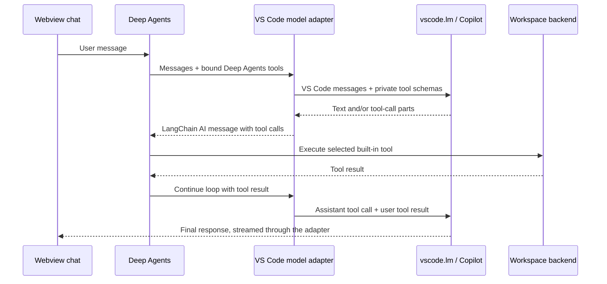

# Deep Agents + VS Code Copilot spike

This extension proves the integration seam between:

- [Deep Agents for JavaScript](https://docs.langchain.com/oss/javascript/deepagents/overview), which owns planning, tool execution, subagents, context handling, and the agentic loop.
- [VS Code's Language Model API](https://code.visualstudio.com/api/extension-guides/ai/language-model), which supplies a Copilot-backed language model.
- A theme-aware workbench with in-memory sessions, model switching, and visible tool calls and results.

## How the integration works



Deep Agents tools are passed as **private, request-local** `LanguageModelChatTool` definitions. They are not contributed through `contributes.languageModelTools`, registered with `vscode.lm.registerTool`, or invoked by VS Code. Copilot only produces the call name and arguments; Deep Agents validates and executes the call.

That distinction is intentional: registering the tools with VS Code would hand invocation control to the VS Code agent/tool system, creating a second agentic loop.

## Run the spike

Prerequisites:

- VS Code 1.105 or newer
- GitHub Copilot installed and signed in
- A folder opened as the workspace
- Node.js 20 or newer

Then:

1. Run `npm install`.
2. Open this folder in VS Code.
3. Press `F5` and choose **Run Extension** if prompted.
4. In the Extension Development Host, select **Deep Agents** in the Activity Bar and click **Open Workbench**. The **Deep Agents: Open Chat** command remains available from the Command Palette.
5. Choose an available Copilot model from the dropdown beside **Send**.
6. Try a prompt such as:

   > Inspect the workspace, read package.json, and create SPIKE-NOTES.md summarizing the architecture.

The first model request can show VS Code's consent prompt. Opening the workbench and sending requests originate from explicit user actions, as required by the Language Model API.

### Workbench sessions and models

The workbench includes a session rail on the left:

- **New chat** creates a separate in-memory transcript and approval scope.
- Selecting a session restores its user and final assistant messages.
- The rename and delete controls appear on hover or on the active session.
- After the first message, the selected Copilot model generates a 5–7 word title in the same language as that message. A manual rename takes precedence if it completes first.
- The model dropdown applies to the next turn and can be changed at any point between turns, including mid-conversation.

Sessions are intentionally memory-only in this spike. They are lost when the workbench panel or Extension Development Host closes; a later persistence layer can retain the same session-facing UI.

### Command execution

The agent has a private `execute_command` tool for builds, tests, linters, and development commands. For example:

> Run the project test suite and explain any failures.

Commands are represented as an executable plus an argument array and run with the first workspace folder as their fixed working directory. The runner:

- Uses `shell: false`; pipes, redirects, variable expansion, and `&&` are not implicitly interpreted.
- Passes an environment allowlist instead of the Extension Host's full environment.
- Rejects the executable or any argument containing `..` before a process is spawned.
- Rejects `~`, `$HOME`, `$PWD`, related home-directory expansion tokens, and absolute argument paths outside the workspace.
- Preflights these path rules before showing the approval card. Invalid requests are rejected back to the agent so it can retry with `.` or a workspace-contained path.
- Defaults to a 60-second timeout, with a hard schema limit of 120 seconds.
- Captures up to 100 KB of combined stdout and stderr.
- Requires explicit approval unless command execution has been allowed for the current chat session.
- Offers **Allow once**, **Allow for session**, and **Deny for now**.
- Shows a concise action label such as **Read package.json**, **Listed workspace files**, or **Ran npm test**.
- Keeps completed tool activity collapsed by default; expand a row to inspect its inputs, stdout, stderr, or other result details.

The approval boundary remains essential. These argument checks prevent direct traversal and expansion attempts, but they are not an operating-system sandbox: an explicitly approved interpreter such as `sh`, `node`, or `python` can still access host paths internally. Strong workspace confinement will require a sandbox backend.

### File-change approvals

`write_file` and `edit_file` pause before changing the workspace. The chat displays the proposed tool arguments and offers:

- **Allow once** — approve the currently displayed operation batch. A later write or edit asks again.
- **Allow for session** — approve the current batch and automatically allow that tool for the lifetime of the active chat session.
- **Deny for now** — reject the current batch and return that denial to the agent so it can adjust its response.

Each chat has its own in-memory approval scope. Switching chats does not transfer allowances; deleting a chat or closing the workbench clears its allowances. Clearing a conversation retains its chat-level allowances.

## Development

```sh
npm run check
npm run build
npm test
```

The extension is bundled to `dist/extension.js`; `vscode` remains external and is supplied by the Extension Host.

## Current spike boundaries

- Workspace access uses Deep Agents' `FilesystemBackend` in virtual mode. `/` maps to the first workspace folder, and traversal outside it is rejected.
- The built-in filesystem/planning/subagent tools are enabled.
- Host process execution is available only through the custom `execute_command` tool. Deep Agents' unrestricted `LocalShellBackend` is not enabled.
- `write_file` and `edit_file` use Deep Agents human-in-the-loop interrupts backed by the shared SQLite LangGraph checkpointer. Startup recovery classifies stale runs and displays recovery state in the originating chat; automatic continuation is intentionally disabled.
- `execute_command` uses the same interrupt mechanism and can be allowed for the active chat session. This allowance covers the tool as a whole, not a particular executable or argument signature.
- VS Code does not support system-role messages in this API, so the adapter encodes LangChain system messages as clearly delimited user-role instructions.
- Conversation sessions, model choices, messages, tool traces, and approval outcomes are persisted per workspace and restored after switching sessions or reloading the Extension Host.
- The UI renders plain text rather than Markdown.
- Multi-root workspaces currently use the first folder.

## Useful next experiments

1. Integrate every tool execution with the durable side-effect ledger and explicit continuation controls.
2. Add per-path approval policies and a visible way to revoke session allowances.
3. Replace whole-tool command session approval with narrowly scoped policies, such as an exact `npm test` signature.
4. Add a workbench tool for diagnostics or active-editor context.
5. Test model-family behavior across the Copilot models returned by `vscode.lm.selectChatModels`.
